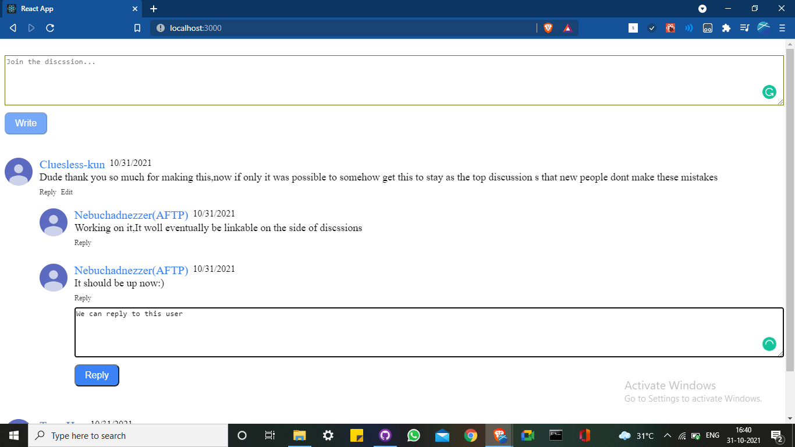
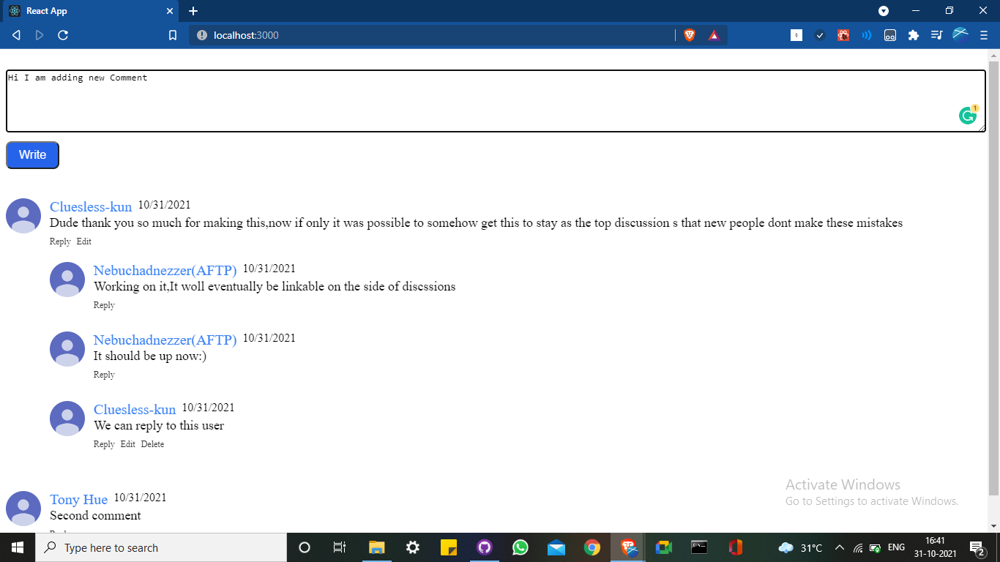

<h2>Weclome to Comment Widget Project</h2>
---------------------------------

<h3>To start the prject use----- npm start ----- command</h3> 

<h4>This runs the project in the default browser in localhost.</h4>
<h3>Project Viw</h3>

<h2>Replying to the user </h2>

<h2>For adding new comment</h2>

